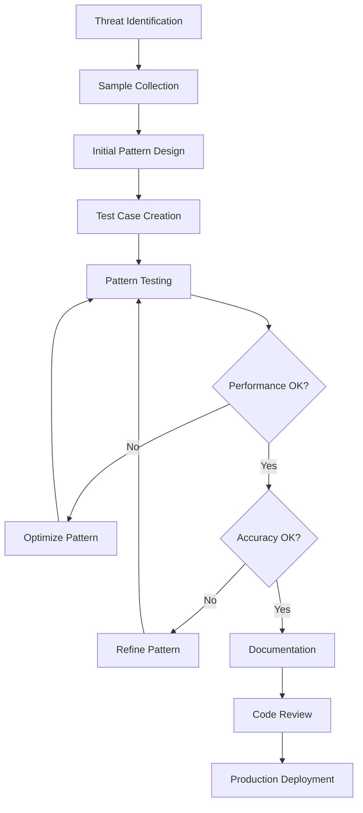

# SecurityFramework Pattern Development Guide

## Overview

Threat patterns are the core of the SecurityFramework's detection capabilities. This comprehensive guide covers everything from basic pattern creation to advanced threat detection techniques. Patterns are defined in JSON format and can be hot-reloaded for dynamic threat response.

## Table of Contents

1. [Pattern Fundamentals](#pattern-fundamentals)
2. [JSON Schema and Structure](#json-schema-and-structure)
3. [Pattern Types](#pattern-types)
4. [Pattern Categories](#pattern-categories)
5. [Development Process](#development-process)
6. [Testing and Validation](#testing-and-validation)
7. [Performance Optimization](#performance-optimization)
8. [Advanced Features](#advanced-features)
9. [Pattern Management](#pattern-management)
10. [Security Considerations](#security-considerations)
11. [Examples and Templates](#examples-and-templates)

## Pattern Fundamentals

### What are Threat Patterns?

Threat patterns are rules that identify malicious or suspicious behavior in web requests. They analyze various aspects of HTTP requests including:

- **URLs and paths**
- **Query parameters**
- **Request headers**
- **User agents**
- **Request bodies**
- **Parameter values**
- **Request frequency and timing**

### Pattern Matching Flow

```
HTTP Request → Pattern Matcher → Pattern Matches → Scoring Engine → Threat Assessment
```

1. **Request Analysis**: Extract relevant data from HTTP request
2. **Pattern Matching**: Apply active patterns to request data
3. **Match Scoring**: Calculate threat score based on matches
4. **Decision Making**: Determine appropriate security action

### Basic Pattern Structure

```json
{
  "name": "SQL Injection Basic",
  "pattern": "(union.*select|select.*from|insert.*into)",
  "type": "Regex",
  "category": "SQLInjection",
  "threatMultiplier": 50,
  "isActive": true,
  "description": "Detects basic SQL injection attempts",
  "metadata": {
    "severity": "high",
    "references": ["CWE-89", "OWASP-A03"],
    "author": "SecurityTeam",
    "version": "1.0"
  }
}
```

## JSON Schema and Structure

### Complete Pattern Schema

```json
{
  "$schema": "http://json-schema.org/draft-07/schema#",
  "title": "SecurityFramework Threat Pattern",
  "type": "object",
  "required": ["name", "pattern", "type", "category", "threatMultiplier"],
  "properties": {
    "name": {
      "type": "string",
      "minLength": 3,
      "maxLength": 100,
      "description": "Human-readable pattern name"
    },
    "pattern": {
      "type": "string",
      "minLength": 1,
      "description": "The actual pattern to match against"
    },
    "type": {
      "type": "string",
      "enum": ["Regex", "Wildcard", "Exact", "Contains", "StartsWith", "EndsWith"],
      "description": "Pattern matching type"
    },
    "category": {
      "type": "string",
      "enum": [
        "SQLInjection", "XSS", "PathTraversal", "ParameterJacking", 
        "BotDetection", "Bruteforce", "RateLimitViolation", 
        "FileUpload", "CommandInjection", "Custom"
      ],
      "description": "Pattern category for organization"
    },
    "threatMultiplier": {
      "type": "number",
      "minimum": 0.1,
      "maximum": 100,
      "description": "Score multiplier for threat calculation (0.1-100)"
    },
    "isActive": {
      "type": "boolean",
      "default": true,
      "description": "Whether pattern is currently active"
    },
    "description": {
      "type": "string",
      "maxLength": 500,
      "description": "Detailed pattern description"
    },
    "metadata": {
      "type": "object",
      "properties": {
        "severity": {
          "type": "string",
          "enum": ["low", "medium", "high", "critical"]
        },
        "references": {
          "type": "array",
          "items": { "type": "string" },
          "description": "References to security standards (CWE, OWASP, etc.)"
        },
        "author": {
          "type": "string",
          "description": "Pattern author"
        },
        "version": {
          "type": "string",
          "pattern": "^\\d+\\.\\d+(\\.\\d+)?$",
          "description": "Pattern version (semver)"
        },
        "lastUpdated": {
          "type": "string",
          "format": "date-time",
          "description": "Last update timestamp"
        },
        "tags": {
          "type": "array",
          "items": { "type": "string" },
          "description": "Searchable tags"
        },
        "testCases": {
          "type": "array",
          "items": {
            "type": "object",
            "properties": {
              "input": { "type": "string" },
              "shouldMatch": { "type": "boolean" },
              "description": { "type": "string" }
            },
            "required": ["input", "shouldMatch"]
          }
        }
      }
    },
    "conditions": {
      "type": "object",
      "description": "Advanced conditional logic",
      "properties": {
        "requestMethods": {
          "type": "array",
          "items": { "type": "string" },
          "description": "HTTP methods this pattern applies to"
        },
        "pathPatterns": {
          "type": "array",
          "items": { "type": "string" },
          "description": "URL path patterns to match"
        },
        "excludePaths": {
          "type": "array",
          "items": { "type": "string" },
          "description": "Paths to exclude from matching"
        },
        "headers": {
          "type": "object",
          "description": "Required headers for pattern activation"
        },
        "timeWindows": {
          "type": "array",
          "items": {
            "type": "object",
            "properties": {
              "start": { "type": "string", "format": "time" },
              "end": { "type": "string", "format": "time" },
              "timezone": { "type": "string" }
            }
          }
        }
      }
    },
    "actions": {
      "type": "object",
      "description": "Actions to take when pattern matches",
      "properties": {
        "logLevel": {
          "type": "string",
          "enum": ["debug", "info", "warning", "error", "critical"]
        },
        "customTags": {
          "type": "array",
          "items": { "type": "string" }
        },
        "webhookUrl": {
          "type": "string",
          "format": "uri"
        },
        "autoBlock": {
          "type": "boolean",
          "description": "Automatically block IP on match"
        },
        "blockDuration": {
          "type": "string",
          "description": "Duration for automatic block (ISO 8601)"
        }
      }
    }
  }
}
```

### Pattern Template Structure

```json
{
  "name": "Security Pattern Template",
  "description": "Template for creating new security patterns",
  "version": "1.0.0",
  "author": "SecurityFramework Team",
  "lastUpdated": "2024-01-15T10:00:00Z",
  "patterns": [
    {
      "name": "Example Pattern",
      "pattern": "example.*pattern",
      "type": "Regex",
      "category": "Custom",
      "threatMultiplier": 25,
      "isActive": true,
      "description": "Example pattern for demonstration",
      "metadata": {
        "severity": "medium",
        "references": ["Custom-001"],
        "author": "Developer",
        "version": "1.0",
        "tags": ["example", "template"],
        "testCases": [
          {
            "input": "example_pattern_match",
            "shouldMatch": true,
            "description": "Should match example pattern"
          },
          {
            "input": "normal_request",
            "shouldMatch": false,
            "description": "Should not match normal requests"
          }
        ]
      }
    }
  ]
}
```

## Pattern Types

### 1. Regex Patterns

Most flexible and powerful pattern type using regular expressions.

```json
{
  "name": "Advanced SQL Injection",
  "pattern": "(?i)(union\\s+(all\\s+)?select|select\\s+.*\\s+from|insert\\s+into|delete\\s+from|update\\s+.*\\s+set|drop\\s+(table|database)|exec(ute)?\\s+|sp_\\w+)",
  "type": "Regex",
  "category": "SQLInjection",
  "threatMultiplier": 75,
  "metadata": {
    "severity": "high",
    "description": "Comprehensive SQL injection detection with case-insensitive matching",
    "testCases": [
      {
        "input": "' UNION SELECT password FROM users--",
        "shouldMatch": true
      },
      {
        "input": "'; DROP TABLE users; --",
        "shouldMatch": true
      },
      {
        "input": "normal user search",
        "shouldMatch": false
      }
    ]
  }
}
```

**Best Practices for Regex Patterns:**
- Use case-insensitive matching with `(?i)` flag
- Avoid catastrophic backtracking (ReDoS)
- Test thoroughly with edge cases
- Keep patterns as specific as possible
- Use non-capturing groups `(?:...)` when appropriate

### 2. Wildcard Patterns

Simple pattern matching using `*` and `?` wildcards.

```json
{
  "name": "PHP File Access",
  "pattern": "*.php*",
  "type": "Wildcard",
  "category": "FileUpload",
  "threatMultiplier": 30,
  "metadata": {
    "severity": "medium",
    "description": "Detects attempts to access PHP files",
    "testCases": [
      {
        "input": "/uploads/shell.php",
        "shouldMatch": true
      },
      {
        "input": "/admin/config.php?param=value",
        "shouldMatch": true
      },
      {
        "input": "/images/photo.jpg",
        "shouldMatch": false
      }
    ]
  }
}
```

### 3. Exact Match Patterns

Precise string matching for known malicious strings.

```json
{
  "name": "Known Malicious User Agent",
  "pattern": "sqlmap/1.0-dev",
  "type": "Exact",
  "category": "BotDetection",
  "threatMultiplier": 90,
  "metadata": {
    "severity": "critical",
    "description": "Detects SQLMap automated testing tool",
    "references": ["https://sqlmap.org/"]
  }
}
```

### 4. Contains Patterns

Checks if input contains specified substring.

```json
{
  "name": "Script Tag Detection",
  "pattern": "<script",
  "type": "Contains",
  "category": "XSS",
  "threatMultiplier": 60,
  "metadata": {
    "severity": "high",
    "description": "Detects potential XSS script injection"
  }
}
```

### 5. StartsWith/EndsWith Patterns

Pattern matching based on string beginning or ending.

```json
{
  "name": "Admin Path Access",
  "pattern": "/admin",
  "type": "StartsWith",
  "category": "PrivilegeEscalation",
  "threatMultiplier": 40,
  "conditions": {
    "excludePaths": ["/admin/public", "/admin/login"]
  }
}
```

## Pattern Categories

### SQL Injection Patterns

```json
{
  "name": "SQL Injection Pattern Set",
  "patterns": [
    {
      "name": "Union-Based SQL Injection",
      "pattern": "(?i)union\\s+(all\\s+)?select",
      "type": "Regex",
      "category": "SQLInjection",
      "threatMultiplier": 80,
      "metadata": {
        "severity": "high",
        "references": ["CWE-89", "OWASP-A03-2021"],
        "description": "Detects UNION-based SQL injection attempts"
      }
    },
    {
      "name": "Boolean-Based SQL Injection",
      "pattern": "(?i)(and|or)\\s+\\d+\\s*=\\s*\\d+",
      "type": "Regex",
      "category": "SQLInjection",
      "threatMultiplier": 70,
      "metadata": {
        "severity": "high",
        "description": "Detects boolean-based blind SQL injection"
      }
    },
    {
      "name": "Time-Based SQL Injection",
      "pattern": "(?i)(sleep|waitfor|delay|pg_sleep)\\s*\\(",
      "type": "Regex",
      "category": "SQLInjection",
      "threatMultiplier": 75,
      "metadata": {
        "severity": "high",
        "description": "Detects time-based blind SQL injection"
      }
    },
    {
      "name": "SQL Comment Injection",
      "pattern": "(--|\\/\\*|\\*\\/|#)",
      "type": "Regex",
      "category": "SQLInjection",
      "threatMultiplier": 50,
      "metadata": {
        "severity": "medium",
        "description": "Detects SQL comment-based injection attempts"
      }
    }
  ]
}
```

### XSS (Cross-Site Scripting) Patterns

```json
{
  "name": "XSS Pattern Set",
  "patterns": [
    {
      "name": "Script Tag XSS",
      "pattern": "(?i)<script[^>]*>.*?</script>",
      "type": "Regex",
      "category": "XSS",
      "threatMultiplier": 85,
      "metadata": {
        "severity": "high",
        "references": ["CWE-79", "OWASP-A07-2021"]
      }
    },
    {
      "name": "JavaScript Protocol XSS",
      "pattern": "(?i)javascript\\s*:",
      "type": "Regex",
      "category": "XSS",
      "threatMultiplier": 70,
      "metadata": {
        "severity": "high",
        "description": "Detects JavaScript protocol injection"
      }
    },
    {
      "name": "Event Handler XSS",
      "pattern": "(?i)on(load|error|click|mouseover|focus|blur)\\s*=",
      "type": "Regex",
      "category": "XSS",
      "threatMultiplier": 75,
      "metadata": {
        "severity": "high",
        "description": "Detects event handler XSS attempts"
      }
    },
    {
      "name": "HTML Entity XSS",
      "pattern": "&#x?[0-9a-f]+;?",
      "type": "Regex",
      "category": "XSS",
      "threatMultiplier": 60,
      "metadata": {
        "severity": "medium",
        "description": "Detects HTML entity encoding bypass attempts"
      }
    }
  ]
}
```

### Path Traversal Patterns

```json
{
  "name": "Path Traversal Pattern Set",
  "patterns": [
    {
      "name": "Directory Traversal",
      "pattern": "(\\.\\./|\\.\\.\\\\/|%2e%2e%2f|%252e%252e%252f|%c0%ae%c0%ae%c0%af)",
      "type": "Regex",
      "category": "PathTraversal",
      "threatMultiplier": 80,
      "metadata": {
        "severity": "high",
        "references": ["CWE-22", "OWASP-A01-2021"]
      }
    },
    {
      "name": "Absolute Path Access",
      "pattern": "(?i)(c:|/etc/|/proc/|/sys/|/dev/|/var/log/)",
      "type": "Regex",
      "category": "PathTraversal",
      "threatMultiplier": 70,
      "metadata": {
        "severity": "high",
        "description": "Detects attempts to access system directories"
      }
    },
    {
      "name": "File Extension Bypass",
      "pattern": "\\.(php|asp|jsp|exe|bat|cmd)\\.",
      "type": "Regex",
      "category": "PathTraversal",
      "threatMultiplier": 60,
      "metadata": {
        "severity": "medium",
        "description": "Detects file extension bypass attempts"
      }
    }
  ]
}
```

### Parameter Jacking Patterns

```json
{
  "name": "Parameter Jacking Pattern Set",
  "patterns": [
    {
      "name": "Sequential ID Probing",
      "pattern": "^\\d+$",
      "type": "Regex",
      "category": "ParameterJacking",
      "threatMultiplier": 30,
      "conditions": {
        "requireSequentialDetection": true
      },
      "metadata": {
        "severity": "medium",
        "description": "Detects sequential numeric ID probing when combined with behavioral analysis"
      }
    },
    {
      "name": "Admin ID Access",
      "pattern": "(?i)(admin|administrator|root|superuser)(_id|id)?",
      "type": "Regex",
      "category": "ParameterJacking",
      "threatMultiplier": 85,
      "metadata": {
        "severity": "high",
        "description": "Detects attempts to access administrative accounts"
      }
    },
    {
      "name": "UUID Manipulation",
      "pattern": "[0-9a-f]{8}-[0-9a-f]{4}-[0-9a-f]{4}-[0-9a-f]{4}-[0-9a-f]{12}",
      "type": "Regex",
      "category": "ParameterJacking",
      "threatMultiplier": 40,
      "metadata": {
        "severity": "medium",
        "description": "Detects UUID parameter manipulation attempts"
      }
    }
  ]
}
```

### Bot Detection Patterns

```json
{
  "name": "Bot Detection Pattern Set",
  "patterns": [
    {
      "name": "Security Scanner User Agents",
      "pattern": "(?i)(nikto|sqlmap|nmap|masscan|zap|burp|acunetix|nessus|openvas|w3af)",
      "type": "Regex",
      "category": "BotDetection",
      "threatMultiplier": 95,
      "metadata": {
        "severity": "critical",
        "description": "Detects known security scanning tools"
      }
    },
    {
      "name": "Suspicious User Agent Patterns",
      "pattern": "(?i)(bot|crawler|spider|scraper|scan)",
      "type": "Regex",
      "category": "BotDetection",
      "threatMultiplier": 25,
      "conditions": {
        "excludePatterns": ["Googlebot", "Bingbot", "facebookexternalhit"]
      },
      "metadata": {
        "severity": "low",
        "description": "Detects generic bot patterns while excluding legitimate crawlers"
      }
    },
    {
      "name": "Empty User Agent",
      "pattern": "",
      "type": "Exact",
      "category": "BotDetection",
      "threatMultiplier": 35,
      "conditions": {
        "checkEmptyUserAgent": true
      },
      "metadata": {
        "severity": "medium",
        "description": "Detects requests with empty User-Agent headers"
      }
    }
  ]
}
```

## Development Process

### 1. Pattern Design Methodology

#### Threat Analysis
1. **Identify Attack Vector**: Understand the specific threat you're targeting
2. **Analyze Attack Patterns**: Study how the attack manifests in HTTP requests
3. **Collect Samples**: Gather both malicious and legitimate examples
4. **Define Scope**: Determine what should and shouldn't match

#### Pattern Creation Steps
1. **Start Simple**: Begin with basic patterns and refine iteratively
2. **Test Extensively**: Use comprehensive test cases
3. **Optimize Performance**: Ensure patterns don't cause performance issues
4. **Document Thoroughly**: Provide clear descriptions and examples

### 2. Pattern Development Workflow



### 3. Pattern Template Development

```bash
# Create new pattern template
mkdir patterns/custom
cd patterns/custom

# Create pattern file
cat > threat-patterns.json << 'EOF'
{
  "name": "Custom Threat Patterns",
  "description": "Organization-specific threat detection patterns",
  "version": "1.0.0",
  "author": "Security Team",
  "lastUpdated": "2024-01-15T10:00:00Z",
  "patterns": []
}
EOF
```

### 4. Pattern Validation Process

```csharp
// Pattern validation example
public class PatternValidator
{
    public async Task<ValidationResult> ValidatePatternAsync(ThreatPattern pattern)
    {
        var result = new ValidationResult();

        // Syntax validation
        if (pattern.Type == PatternType.Regex)
        {
            if (!IsValidRegex(pattern.Pattern))
            {
                result.Errors.Add("Invalid regex syntax");
            }
        }

        // Performance validation
        var performanceScore = await TestPatternPerformanceAsync(pattern);
        if (performanceScore > 100) // ms
        {
            result.Warnings.Add($"Pattern may impact performance ({performanceScore}ms avg)");
        }

        // Security validation
        if (HasBacktrackingRisk(pattern.Pattern))
        {
            result.Errors.Add("Pattern has catastrophic backtracking risk (ReDoS)");
        }

        // Test case validation
        foreach (var testCase in pattern.Metadata.TestCases)
        {
            var matches = await TestPatternAsync(pattern, testCase.Input);
            if (matches != testCase.ShouldMatch)
            {
                result.Errors.Add($"Test case failed: {testCase.Description}");
            }
        }

        return result;
    }
}
```

## Testing and Validation

### 1. Unit Testing Patterns

```json
{
  "name": "SQL Injection Test Pattern",
  "pattern": "(?i)(union\\s+select|select\\s+.*\\s+from)",
  "type": "Regex",
  "category": "SQLInjection",
  "threatMultiplier": 70,
  "metadata": {
    "testCases": [
      {
        "input": "' UNION SELECT password FROM users",
        "shouldMatch": true,
        "description": "Basic UNION injection"
      },
      {
        "input": "'; SELECT * FROM admin_users; --",
        "shouldMatch": true,
        "description": "Stacked query injection"
      },
      {
        "input": "search for union representatives",
        "shouldMatch": false,
        "description": "Legitimate use of word 'union'"
      },
      {
        "input": "select your preferences from the menu",
        "shouldMatch": false,
        "description": "Legitimate use of 'select from'"
      },
      {
        "input": "1' UNION/*comment*/SELECT null--",
        "shouldMatch": true,
        "description": "Comment-obfuscated injection"
      },
      {
        "input": "1'+UNION+SELECT+password+FROM+users--",
        "shouldMatch": true,
        "description": "URL-encoded injection"
      }
    ]
  }
}
```

### 2. Performance Testing

```csharp
[Fact]
public async Task PatternPerformance_BenchmarkTest()
{
    var pattern = new ThreatPattern
    {
        Name = "Complex SQL Injection",
        Pattern = @"(?i)(union\s+(all\s+)?select|select\s+.*\s+from|insert\s+into|delete\s+from|update\s+.*\s+set|drop\s+(table|database)|exec(ute)?\s+|sp_\w+)",
        Type = PatternType.Regex,
        ThreatMultiplier = 75
    };

    var testInputs = GenerateTestInputs(1000);
    var stopwatch = Stopwatch.StartNew();

    foreach (var input in testInputs)
    {
        await _patternMatcher.MatchAsync(pattern, input);
    }

    stopwatch.Stop();
    var avgTime = stopwatch.ElapsedMilliseconds / (double)testInputs.Count;
    
    Assert.True(avgTime < 1.0, $"Pattern matching too slow: {avgTime}ms avg");
}
```

### 3. False Positive Testing

```json
{
  "name": "False Positive Test Suite",
  "description": "Tests to ensure patterns don't trigger on legitimate content",
  "testCases": [
    {
      "category": "SQLInjection",
      "legitimateInputs": [
        "I want to select from various options",
        "Please insert into the database normally",
        "Union workers are on strike",
        "Update your profile information",
        "Drop off location for delivery"
      ]
    },
    {
      "category": "XSS",
      "legitimateInputs": [
        "I love JavaScript programming",
        "The onclick event in programming",
        "<b>Bold text</b> formatting",
        "Email me at user@example.com"
      ]
    },
    {
      "category": "PathTraversal",
      "legitimateInputs": [
        "Navigate to parent directory",
        "File.extension.backup",
        "C: drive information",
        "/etc/nginx configuration guide"
      ]
    }
  ]
}
```

### 4. Automated Testing Framework

```csharp
public class PatternTestFramework
{
    private readonly IPatternService _patternService;
    private readonly ILogger<PatternTestFramework> _logger;

    public async Task<TestResult> RunTestSuiteAsync(string patternFile)
    {
        var patterns = await LoadPatternsAsync(patternFile);
        var results = new TestResult();

        foreach (var pattern in patterns)
        {
            var patternResult = await TestPatternAsync(pattern);
            results.PatternResults.Add(patternResult);

            if (patternResult.HasErrors)
            {
                _logger.LogError("Pattern {PatternName} failed tests: {Errors}", 
                    pattern.Name, string.Join(", ", patternResult.Errors));
            }
        }

        return results;
    }

    private async Task<PatternTestResult> TestPatternAsync(ThreatPattern pattern)
    {
        var result = new PatternTestResult { PatternName = pattern.Name };

        // Test all test cases
        foreach (var testCase in pattern.Metadata.TestCases)
        {
            var matches = await _patternService.TestPatternAsync(pattern.Id, new[] { testCase.Input });
            var actualMatch = matches.Any();

            if (actualMatch != testCase.ShouldMatch)
            {
                result.Errors.Add($"Test case '{testCase.Description}' failed");
            }
        }

        // Performance test
        var performanceScore = await MeasurePatternPerformanceAsync(pattern);
        if (performanceScore > 10) // ms
        {
            result.Warnings.Add($"Performance concern: {performanceScore}ms");
        }

        // ReDoS test
        if (await HasBacktrackingRiskAsync(pattern.Pattern))
        {
            result.Errors.Add("Catastrophic backtracking risk detected");
        }

        return result;
    }
}
```

## Performance Optimization

### 1. Pattern Performance Guidelines

#### Regex Optimization
- **Avoid nested quantifiers**: `(a+)+` can cause exponential backtracking
- **Use atomic groups**: `(?>...)` prevents backtracking
- **Prefer possessive quantifiers**: `++`, `*+`, `?+`
- **Anchor patterns**: Use `^` and `$` when appropriate
- **Use word boundaries**: `\b` for more precise matching

#### Example: Optimized SQL Injection Pattern

```json
{
  "name": "Optimized SQL Injection",
  "pattern": "(?i)\\b(union\\s+(?:all\\s+)?select|select\\s+.{1,100}?\\s+from|insert\\s+into|delete\\s+from)\\b",
  "type": "Regex",
  "category": "SQLInjection",
  "threatMultiplier": 75,
  "metadata": {
    "optimizations": [
      "Added word boundaries to reduce false matches",
      "Limited .* quantifier to prevent excessive backtracking",
      "Used non-greedy quantifier .{1,100}? for better performance"
    ]
  }
}
```

### 2. Pattern Compilation

```csharp
public class CompiledPatternMatcher
{
    private readonly ConcurrentDictionary<Guid, Regex> _compiledPatterns;
    private readonly RegexOptions _regexOptions;

    public CompiledPatternMatcher()
    {
        _compiledPatterns = new ConcurrentDictionary<Guid, Regex>();
        _regexOptions = RegexOptions.Compiled | 
                       RegexOptions.IgnoreCase | 
                       RegexOptions.CultureInvariant |
                       RegexOptions.ExplicitCapture;
    }

    public async Task<PatternMatch[]> MatchPatternsAsync(string input, IEnumerable<ThreatPattern> patterns)
    {
        var matches = new List<PatternMatch>();
        var timeout = TimeSpan.FromMilliseconds(100);

        await Parallel.ForEachAsync(patterns, async (pattern, ct) =>
        {
            try
            {
                var regex = GetCompiledRegex(pattern);
                var match = await Task.Run(() => regex.Match(input), ct);
                
                if (match.Success)
                {
                    matches.Add(new PatternMatch
                    {
                        PatternId = pattern.Id,
                        PatternName = pattern.Name,
                        MatchedValue = match.Value,
                        ThreatMultiplier = pattern.ThreatMultiplier
                    });
                }
            }
            catch (RegexMatchTimeoutException)
            {
                // Log timeout and continue
                _logger.LogWarning("Pattern {PatternName} timed out", pattern.Name);
            }
        });

        return matches.ToArray();
    }

    private Regex GetCompiledRegex(ThreatPattern pattern)
    {
        return _compiledPatterns.GetOrAdd(pattern.Id, _ =>
        {
            var timeout = TimeSpan.FromMilliseconds(100);
            return new Regex(pattern.Pattern, _regexOptions, timeout);
        });
    }
}
```

### 3. Caching Strategies

```csharp
public class CachedPatternMatcher
{
    private readonly IMemoryCache _cache;
    private readonly TimeSpan _cacheExpiry = TimeSpan.FromMinutes(5);

    public async Task<PatternMatch[]> MatchWithCacheAsync(string input, IEnumerable<ThreatPattern> patterns)
    {
        var cacheKey = GenerateCacheKey(input, patterns);
        
        if (_cache.TryGetValue(cacheKey, out PatternMatch[] cachedResult))
        {
            return cachedResult;
        }

        var result = await MatchPatternsAsync(input, patterns);
        
        _cache.Set(cacheKey, result, _cacheExpiry);
        return result;
    }

    private string GenerateCacheKey(string input, IEnumerable<ThreatPattern> patterns)
    {
        var inputHash = ComputeHash(input);
        var patternsHash = ComputeHash(string.Join(",", patterns.Select(p => p.Id)));
        return $"pattern_match:{inputHash}:{patternsHash}";
    }
}
```

## Advanced Features

### 1. Conditional Patterns

Patterns that only activate under specific conditions:

```json
{
  "name": "Admin Panel SQL Injection",
  "pattern": "(?i)(union\\s+select|select\\s+.*\\s+from)",
  "type": "Regex",
  "category": "SQLInjection",
  "threatMultiplier": 90,
  "conditions": {
    "pathPatterns": ["/admin/*", "/dashboard/*", "/management/*"],
    "requestMethods": ["POST", "PUT"],
    "headers": {
      "X-Requested-With": "XMLHttpRequest"
    },
    "timeWindows": [
      {
        "start": "09:00",
        "end": "17:00",
        "timezone": "UTC"
      }
    ]
  },
  "metadata": {
    "description": "High-severity SQL injection detection for admin areas during business hours"
  }
}
```

### 2. Pattern Chaining

Combine multiple patterns for complex detection:

```json
{
  "name": "Sophisticated Attack Chain",
  "type": "Chain",
  "category": "Advanced",
  "threatMultiplier": 100,
  "patterns": [
    {
      "name": "Reconnaissance",
      "pattern": "(?i)(robots\\.txt|sitemap\\.xml|\\.git/|backup)",
      "weight": 0.3
    },
    {
      "name": "Vulnerability Scanning",
      "pattern": "(?i)(nikto|sqlmap|nmap|dirb)",
      "weight": 0.4
    },
    {
      "name": "Exploitation Attempt",
      "pattern": "(?i)(union\\s+select|<script|\\.\\./))",
      "weight": 0.8
    }
  ],
  "conditions": {
    "timeWindow": "00:15:00",
    "minimumScore": 1.0
  }
}
```

### 3. Machine Learning Integration

Patterns that integrate with ML models:

```json
{
  "name": "ML-Enhanced Bot Detection",
  "pattern": "ml_model:bot_detector_v2",
  "type": "MachineLearning",
  "category": "BotDetection",
  "threatMultiplier": 60,
  "mlConfig": {
    "modelPath": "models/bot_detector_v2.onnx",
    "features": [
      "user_agent_entropy",
      "request_frequency",
      "parameter_patterns",
      "timing_patterns"
    ],
    "threshold": 0.75,
    "confidenceLevel": 0.8
  }
}
```

### 4. Dynamic Pattern Generation

Automatically generate patterns based on observed attacks:

```csharp
public class DynamicPatternGenerator
{
    public async Task<ThreatPattern[]> GenerateFromIncidentsAsync(
        IEnumerable<SecurityIncident> incidents)
    {
        var patterns = new List<ThreatPattern>();
        
        // Group incidents by attack type
        var sqlInjectionIncidents = incidents
            .Where(i => i.Type == IncidentType.SQLInjection)
            .ToList();

        if (sqlInjectionIncidents.Count >= 10)
        {
            var commonPatterns = ExtractCommonPatterns(sqlInjectionIncidents);
            foreach (var pattern in commonPatterns)
            {
                patterns.Add(new ThreatPattern
                {
                    Name = $"Auto-Generated SQL Pattern {DateTime.UtcNow:yyyyMMdd}",
                    Pattern = pattern,
                    Type = PatternType.Regex,
                    Category = "SQLInjection",
                    ThreatMultiplier = 50,
                    IsActive = false, // Require manual review
                    Metadata = new Dictionary<string, object>
                    {
                        ["auto_generated"] = true,
                        ["based_on_incidents"] = sqlInjectionIncidents.Count,
                        ["confidence"] = CalculateConfidence(pattern, sqlInjectionIncidents)
                    }
                });
            }
        }

        return patterns.ToArray();
    }
}
```

## Pattern Management

### 1. Version Control Integration

```bash
# Git hooks for pattern validation
#!/bin/bash
# pre-commit hook for pattern validation

echo "Validating threat patterns..."

for file in patterns/**/*.json; do
    echo "Validating $file"
    
    # JSON syntax validation
    if ! jq empty "$file" 2>/dev/null; then
        echo "ERROR: Invalid JSON in $file"
        exit 1
    fi
    
    # Schema validation
    if ! ajv validate -s pattern-schema.json -d "$file"; then
        echo "ERROR: Schema validation failed for $file"
        exit 1
    fi
    
    # Performance testing
    if ! pattern-tester --performance "$file"; then
        echo "ERROR: Performance test failed for $file"
        exit 1
    fi
done

echo "All patterns validated successfully"
```

### 2. Hot Reload Implementation

```csharp
public class HotReloadPatternService : IPatternService
{
    private readonly FileSystemWatcher _fileWatcher;
    private readonly ILogger<HotReloadPatternService> _logger;
    private readonly ConcurrentDictionary<string, DateTime> _lastModified;

    public HotReloadPatternService()
    {
        _lastModified = new ConcurrentDictionary<string, DateTime>();
        SetupFileWatcher();
    }

    private void SetupFileWatcher()
    {
        _fileWatcher = new FileSystemWatcher(_patternsDirectory, "*.json");
        _fileWatcher.NotifyFilter = NotifyFilters.LastWrite | NotifyFilters.FileName;
        _fileWatcher.Changed += OnPatternFileChanged;
        _fileWatcher.Created += OnPatternFileChanged;
        _fileWatcher.Deleted += OnPatternFileChanged;
        _fileWatcher.EnableRaisingEvents = true;
    }

    private async void OnPatternFileChanged(object sender, FileSystemEventArgs e)
    {
        try
        {
            // Debounce rapid file changes
            var lastModified = File.GetLastWriteTime(e.FullPath);
            if (_lastModified.TryGetValue(e.FullPath, out var previousTime) &&
                lastModified.Subtract(previousTime).TotalMilliseconds < 1000)
            {
                return;
            }

            _lastModified[e.FullPath] = lastModified;

            _logger.LogInformation("Pattern file changed: {FilePath}", e.FullPath);

            switch (e.ChangeType)
            {
                case WatcherChangeTypes.Created:
                case WatcherChangeTypes.Changed:
                    await ReloadPatternFileAsync(e.FullPath);
                    break;
                case WatcherChangeTypes.Deleted:
                    await RemovePatternsFromFileAsync(e.FullPath);
                    break;
            }
        }
        catch (Exception ex)
        {
            _logger.LogError(ex, "Error handling pattern file change: {FilePath}", e.FullPath);
        }
    }

    private async Task ReloadPatternFileAsync(string filePath)
    {
        try
        {
            // Validate before loading
            var validationResult = await ValidatePatternFileAsync(filePath);
            if (!validationResult.IsValid)
            {
                _logger.LogError("Pattern file validation failed: {Errors}", 
                    string.Join(", ", validationResult.Errors));
                return;
            }

            // Load and activate patterns
            var patternsLoaded = await LoadPatternsFromJsonAsync(filePath);
            _logger.LogInformation("Reloaded {Count} patterns from {File}", 
                patternsLoaded, Path.GetFileName(filePath));

            // Notify subscribers
            await NotifyPatternReloadAsync(filePath, patternsLoaded);
        }
        catch (Exception ex)
        {
            _logger.LogError(ex, "Failed to reload pattern file: {FilePath}", filePath);
        }
    }
}
```

### 3. Pattern Analytics

```csharp
public class PatternAnalyticsService
{
    public async Task<PatternAnalytics> GetPatternAnalyticsAsync(TimeSpan period)
    {
        var endTime = DateTime.UtcNow;
        var startTime = endTime.Subtract(period);

        var analytics = new PatternAnalytics
        {
            Period = period,
            StartTime = startTime,
            EndTime = endTime
        };

        // Pattern match statistics
        var matches = await _repository.GetPatternMatchesAsync(startTime, endTime);
        analytics.TotalMatches = matches.Count();
        
        analytics.TopPatterns = matches
            .GroupBy(m => m.PatternId)
            .Select(g => new PatternStatistics
            {
                PatternId = g.Key,
                PatternName = g.First().PatternName,
                MatchCount = g.Count(),
                ThreatScore = g.Average(m => m.ThreatMultiplier),
                FalsePositiveRate = CalculateFalsePositiveRate(g)
            })
            .OrderByDescending(p => p.MatchCount)
            .Take(10)
            .ToList();

        // Performance analytics
        analytics.AverageMatchTime = await GetAverageMatchTimeAsync(startTime, endTime);
        analytics.SlowestPatterns = await GetSlowestPatternsAsync(startTime, endTime);

        return analytics;
    }
}
```

## Security Considerations

### 1. ReDoS (Regular Expression Denial of Service) Prevention

```csharp
public class ReDoSDetector
{
    public bool HasBacktrackingRisk(string pattern)
    {
        var riskPatterns = new[]
        {
            @"\([^)]*\)\*",           // (...)* 
            @"\([^)]*\)\+",           // (...)+ 
            @"\*.*\*",                // *...*
            @"\+.*\+",                // +...+
            @"(\w+)+",                // (\w+)+
            @"(\w*)*",                // (\w*)*
            @"(\w+)+\$",              // (\w+)+$
        };

        return riskPatterns.Any(risk => Regex.IsMatch(pattern, risk));
    }

    public async Task<bool> TestForBacktrackingAsync(string pattern, int timeoutMs = 1000)
    {
        var testInputs = new[]
        {
            new string('a', 100),
            new string('a', 1000) + "X",
            new string('a', 50) + new string('b', 50),
            string.Concat(Enumerable.Repeat("ab", 100))
        };

        foreach (var input in testInputs)
        {
            var stopwatch = Stopwatch.StartNew();
            try
            {
                var regex = new Regex(pattern, RegexOptions.None, TimeSpan.FromMilliseconds(timeoutMs));
                var matches = regex.IsMatch(input);
                stopwatch.Stop();

                if (stopwatch.ElapsedMilliseconds > timeoutMs / 2)
                {
                    return true; // Potential ReDoS
                }
            }
            catch (RegexMatchTimeoutException)
            {
                return true; // Definite ReDoS
            }
        }

        return false;
    }
}
```

### 2. Pattern Security Best Practices

#### Safe Regex Patterns
```json
{
  "goodPatterns": [
    {
      "pattern": "(?i)\\b(union\\s+select|select\\s+from)\\b",
      "description": "Uses word boundaries to prevent partial matches"
    },
    {
      "pattern": "(?i)script\\s*>",
      "description": "Simple, specific pattern with minimal backtracking risk"
    },
    {
      "pattern": "^[a-zA-Z0-9]{1,20}$",
      "description": "Anchored pattern with explicit length limits"
    }
  ],
  "dangerousPatterns": [
    {
      "pattern": "(a+)+",
      "issue": "Catastrophic backtracking",
      "fix": "Use atomic groups: (?>a+)+"
    },
    {
      "pattern": ".*.*.*",
      "issue": "Excessive backtracking",
      "fix": "Use more specific patterns"
    },
    {
      "pattern": "(\\w+)*\\1",
      "issue": "Backreference with quantifier",
      "fix": "Avoid backreferences in performance-critical patterns"
    }
  ]
}
```

### 3. Pattern Access Control

```csharp
[Authorize(Roles = "SecurityAdmin")]
public class PatternManagementController : ControllerBase
{
    [HttpPost("patterns")]
    public async Task<ActionResult> CreatePattern([FromBody] ThreatPattern pattern)
    {
        // Validate pattern security
        var securityValidation = await _patternSecurity.ValidatePatternAsync(pattern);
        if (!securityValidation.IsSecure)
        {
            return BadRequest(new { 
                message = "Pattern failed security validation", 
                issues = securityValidation.Issues 
            });
        }

        // Check for ReDoS
        if (await _redosDetector.HasBacktrackingRiskAsync(pattern.Pattern))
        {
            return BadRequest("Pattern has ReDoS vulnerability");
        }

        // Audit log
        _auditLogger.LogPatternCreation(User.Identity.Name, pattern);

        var result = await _patternService.AddPatternAsync(pattern);
        return CreatedAtAction(nameof(GetPattern), new { id = result.Id }, result);
    }

    [HttpPut("patterns/{id}/status")]
    public async Task<ActionResult> UpdatePatternStatus(Guid id, [FromBody] PatternStatusUpdate update)
    {
        var pattern = await _patternService.GetPatternAsync(id);
        if (pattern == null)
        {
            return NotFound();
        }

        // Require approval for activation
        if (update.IsActive && !pattern.IsActive)
        {
            if (!User.IsInRole("SecurityManager"))
            {
                return Forbid("Pattern activation requires SecurityManager role");
            }
        }

        _auditLogger.LogPatternStatusChange(User.Identity.Name, id, pattern.IsActive, update.IsActive);

        await _patternService.UpdatePatternStatusAsync(id, update.IsActive);
        return NoContent();
    }
}
```

## Examples and Templates

### 1. Complete OWASP Top 10 Pattern Set

```json
{
  "name": "OWASP Top 10 2021 Patterns",
  "description": "Comprehensive pattern set covering OWASP Top 10 vulnerabilities",
  "version": "2021.1.0",
  "author": "OWASP Community",
  "lastUpdated": "2024-01-15T10:00:00Z",
  "patterns": [
    {
      "name": "A01 Broken Access Control - Path Traversal",
      "pattern": "(\\.\\./|\\.\\.\\\\/|%2e%2e%2f|%252e%252e%252f)",
      "type": "Regex",
      "category": "PathTraversal",
      "threatMultiplier": 80,
      "metadata": {
        "severity": "high",
        "references": ["OWASP-A01-2021", "CWE-22"],
        "description": "Detects directory traversal attempts"
      }
    },
    {
      "name": "A02 Cryptographic Failures - Sensitive Data Exposure",
      "pattern": "(?i)(password|passwd|pwd|secret|key|token)\\s*[:=]\\s*[\"']?[\\w\\-+/=]{8,}",
      "type": "Regex",
      "category": "DataExposure",
      "threatMultiplier": 70,
      "metadata": {
        "severity": "high",
        "references": ["OWASP-A02-2021", "CWE-311"]
      }
    },
    {
      "name": "A03 Injection - SQL Injection",
      "pattern": "(?i)(union\\s+(all\\s+)?select|select\\s+.*\\s+from|insert\\s+into|delete\\s+from|update\\s+.*\\s+set|drop\\s+(table|database))",
      "type": "Regex",
      "category": "SQLInjection",
      "threatMultiplier": 90,
      "metadata": {
        "severity": "critical",
        "references": ["OWASP-A03-2021", "CWE-89"]
      }
    }
  ]
}
```

### 2. E-commerce Security Patterns

```json
{
  "name": "E-commerce Security Patterns",
  "description": "Specialized patterns for e-commerce platform protection",
  "patterns": [
    {
      "name": "Price Manipulation",
      "pattern": "(?i)(price|cost|amount|total)\\s*[:=]\\s*['\"]?-?\\d*\\.?\\d+['\"]?",
      "type": "Regex",
      "category": "ParameterJacking",
      "threatMultiplier": 85,
      "conditions": {
        "requestMethods": ["POST", "PUT"],
        "pathPatterns": ["/cart/*", "/checkout/*", "/order/*"]
      }
    },
    {
      "name": "Admin Product Access",
      "pattern": "(?i)(admin|manage|edit).*product",
      "type": "Regex",
      "category": "PrivilegeEscalation",
      "threatMultiplier": 75,
      "conditions": {
        "excludePaths": ["/admin/login", "/admin/public"]
      }
    },
    {
      "name": "Payment Card Data",
      "pattern": "\\b(?:4[0-9]{12}(?:[0-9]{3})?|5[1-5][0-9]{14}|3[47][0-9]{13}|3[0-9]{13}|6(?:011|5[0-9]{2})[0-9]{12})\\b",
      "type": "Regex",
      "category": "DataExposure",
      "threatMultiplier": 95,
      "metadata": {
        "description": "Detects credit card numbers in requests"
      }
    }
  ]
}
```

### 3. API Security Patterns

```json
{
  "name": "API Security Patterns",
  "description": "Patterns for REST API protection",
  "patterns": [
    {
      "name": "API Key in URL",
      "pattern": "(?i)[?&](api_?key|apikey|access_?token)=[a-zA-Z0-9+/=]{16,}",
      "type": "Regex",
      "category": "DataExposure",
      "threatMultiplier": 60,
      "metadata": {
        "description": "Detects API keys exposed in URL parameters"
      }
    },
    {
      "name": "Bulk Data Export",
      "pattern": "(?i)(export|dump|backup|download).*\\b(all|users|customers|products)\\b",
      "type": "Regex",
      "category": "DataExfiltration",
      "threatMultiplier": 70
    },
    {
      "name": "API Enumeration",
      "pattern": "^/api/v\\d+/\\w+/\\d+$",
      "type": "Regex",
      "category": "ParameterJacking",
      "threatMultiplier": 30,
      "conditions": {
        "requireSequentialDetection": true
      }
    }
  ]
}
```

### 4. Custom Business Logic Patterns

```json
{
  "name": "Banking Application Patterns",
  "description": "Custom patterns for banking applications",
  "patterns": [
    {
      "name": "Account Number Enumeration",
      "pattern": "^\\d{10,16}$",
      "type": "Regex",
      "category": "ParameterJacking",
      "threatMultiplier": 80,
      "conditions": {
        "pathPatterns": ["/account/*", "/balance/*", "/transfer/*"],
        "requireSequentialDetection": true,
        "sequentialThreshold": 3
      }
    },
    {
      "name": "Large Transfer Amount",
      "pattern": "(?i)(amount|transfer|send)\\s*[:=]\\s*['\"]?[1-9]\\d{4,}",
      "type": "Regex",
      "category": "BusinessLogic",
      "threatMultiplier": 60,
      "conditions": {
        "pathPatterns": ["/transfer", "/payment"]
      }
    },
    {
      "name": "Admin Banking Functions",
      "pattern": "(?i)(admin|manage|control)\\s*(account|transfer|balance)",
      "type": "Regex",
      "category": "PrivilegeEscalation",
      "threatMultiplier": 90
    }
  ]
}
```

---

> **Next Steps**: After creating patterns, test them thoroughly using the [Testing Guide](Testing-Guide.md), and integrate them into your application following the [Integration Guide](Integration-Guide.md). For advanced configuration options, see the [Configuration Guide](Configuration.md).